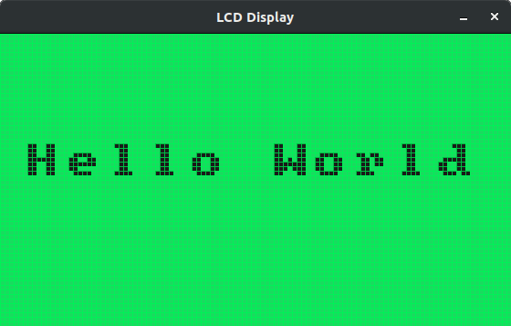

# LCD Simulation library

## Motivation

Building user interfaces for small microcontrollers is a pain. You need to
visualize your changes to have a feeling how it is working, but it takes 
too long to compile and burn to the device.

With this library you can save the burning step and test your user interface
in your pc. Not only the graphics part, but the user interaction (keyboard) 
too.

## Usage

The library is located in the lib directory. It has two files, uisim.h and 
uisim.c. It uses the [SDL2](https://www.libsdl.org/index.php) library to draw 
the virtual lcd screen and to read the user input via keyboard.

